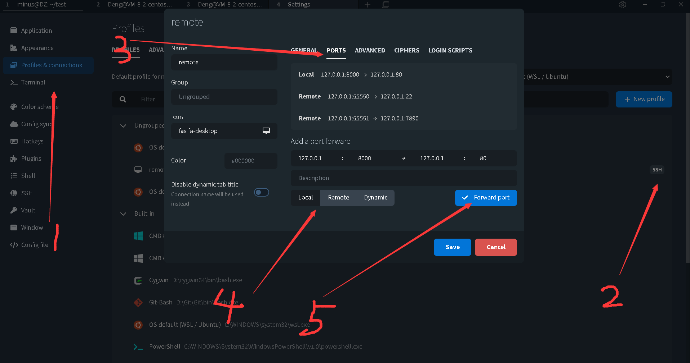

- [SSH port forwarding - Example, command, server config](https://www.ssh.com/academy/ssh/tunneling/example)
- [外网 SSH 连接内网 Windows 上 linux 虚拟机](https://xumingmingming.github.io/2019/06/28/linux/wai-wang-ssh-lian-jie-nei-wang-windows-shang-linux-xu-ni-ji/)
- [自建服务器解决外网访问内网的端口穿透映射](https://blog.mimvp.com/article/28549.html)

## command line

如果你有一个有公网 ip 的服务器，那做起内网穿透会有很大的自由度。

（一）、 ssh 内网穿透

我将 ssh 内网穿透放在第一位，因为它只经过自己的服务器，按照自己设定的命令进行操作，所以比较安全、稳定。

理论部分

ssh 的三个强大的端口转发命令：

转发到远端：ssh -C -f -N -g -L 本地端口:目标 IP:目标端口 用户名@目标 IP

转发到本地：ssh -C -f -N -g –R 本地端口:目标 IP:目标端口 用户名@目标 IP

动态端口转发：ssh -C -f -N -g -D listen_port 用户名@目标 IP

-C：压缩数据传输。

-f ：后台认证用户/密码，通常和-N 连用，不用登录到远程主机。

-N ：不执行脚本或命令，通常与-f 连用。

-g ：在-L/-R/-D 参数中，允许远程主机连接到建立的转发的端口，如果不加这个参数，只允许本地主机建立连接。

-L 本地端口:目标 IP:目标端口：将本地机(客户机)的某个端口转发到远端指定机器的指定端口. 工作原理是这样的, 本地机器上分配了一个 socket 侦听 port 端口, 一旦这个端口上有了连接, 该连接就经过安全通道转发出去, 同时远程主机和 host 的 hostport 端口建立连接. 可以在配置文件中指定端口的转发. 只有 root 才能转发特权端口. IPv6 地址用另一种格式说明: port/host/hostport

-R 本地端口:目标 IP:目标端口：将远程主机(服务器)的某个端口转发到本地端指定机器的指定端口. 工作原理是这样的, 远程主机上分配了一个 socket 侦听 port 端口, 一旦这个端口上有了连接, 该连接就经过安全通道转向出去, 同时本地主机和 host 的 hostport 端口建立连接. 可以在配置文件中指定端口的转发. 只有用 root 登录远程主机才能转发特权端口. IPv6 地址用另一种格式说明: port/host/hostport

-p ：被登录的 ssd 服务器的 sshd 服务端口。

-D listen_port：指定一个本地机器 “动态的'’ 应用程序端口转发. 工作原理是这样的, 本地机器上分配了一个 socket 侦听 port 端口, 一旦这个端口上有了连接, 该连接就经过安全通道转发出去, 根据应用程序的协议可以判断出远程主机将和哪里连接. 目前支持 SOCKS4 协议, 将充当 SOCKS4 服务器. 只有 root 才能转发特权端口. 可以在配置文件中指定动态端口的转发.

实践部分

（1）只有树莓派和服务器

1. 在树莓派上，通过远程端口映射，将服务器的 2222 端口映射到树莓派的 22 端口：

`ssh -fNR 2222:localhost:22 root@公网 IP`

2. 服务器上访问树莓派：

`ssh -p 2222 pi@localhost`

但事实上，有时候我们可能更需要另一个设备可以访问树莓派，而不是在服务器上访问。因此这个时候我们就需要做两次映射。

（2）树莓派、服务器、第三方设备

1. 在树莓派上，通过远程端口映射，将服务器的 2222 端口映射到树莓派的 22 端口：

`ssh -fNR 2222:localhost:22 root@公网 IP`

2. 在第三方设备上，通过本地端口映射，将第三方设备的 2222 端口映射到服务器的 2222 端口：

`ssh -fNL 2222:localhost:2222 root@公网 IP`

3. 在第三方设备上访问树莓派

`ssh -p 2222 pi@localhost`

## tabby terminal

4. 选择是**本地映射到远程**, 还是**远程映射到本地**
5. 记得添加
